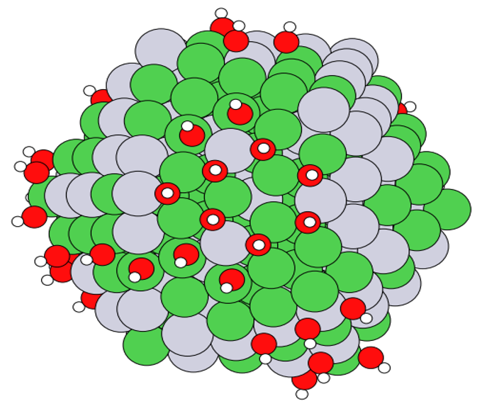
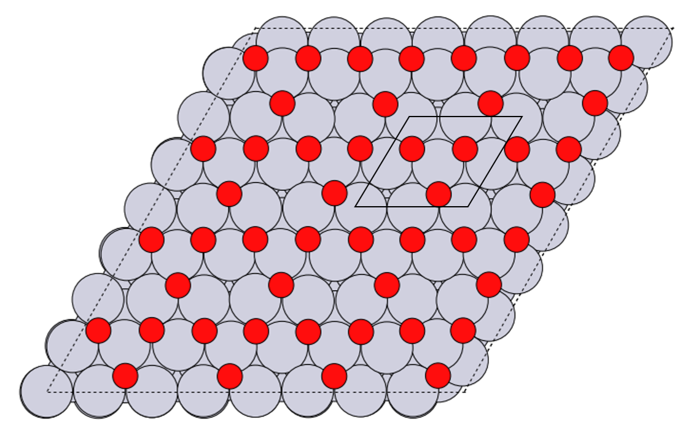

# Cabins: a Python Toolkit for **CA**talysis on **BI**metallic **N**anoparticles and **S**urfaces
A Python code for generating and encoding adsorbate coverage patterns on surfaces and nanoparticles.

## Developers: 
Shuang Han (shuha@dtu.dk) - current maintainer

Steen Lysgaard (stly@dtu.dk)

## Dependencies
* Python3
* Numpy
* NetworkX
* ASE
* Asap3

## Installation
Clone this repository:

```git clone https://gitlab.com/shuanghan/nanopads.git```

Then edit ```~/.bashrc``` to add

```export PYTHONPATH=/path-to-nanopads/:$PYTHONPATH```

Remember to ```source ~/.bashrc```
## Usage
### Add adsorbates
The code can automatically identify the shape and surfaces of nanoparticles, or the type of surface slabs.


To add adsorbate to a monometallic system (or if you want to ignore the elemental composition), see example:
```python
from nanopads.adsorption_sites import monometallic_add_adsorbate
from ase.io import read, write
from ase.visualize import view

atoms = read('NiPt3_111_surface.traj')
system = monometallic_add_adsorbate(atoms, adsorbate='OH', site='ontop', nsite=5)
system = monometallic_add_adsorbate(system, adsorbate='OH', site='bridge', nsite=6)
system = monometallic_add_adsorbate(system, adsorbate='OH', site='fcc', nsite=7)
system = monometallic_add_adsorbate(system, adsorbate='OH', site='hcp', nsite=8)
view(system)
```
Out:


To add adsorbate to a bimetallic system, see example:
```python
from nanopads.adsorption_sites import bimetallic_add_adsorbate
from ase.io import read, write
from ase.visualize import view

atoms = read('random_icosahedron_NiPt_309.traj')
system = bimetallic_add_adsorbate(atoms, adsorbate='OH', site='hcp', 
surface='fcc111', composition='NiNiPt', second_shell='Ni', nsite='all')
view(system)
```
Out:



### Enumerate sites 
To enumerate all possible adsorption of a nanoparticle or surface slab, see example:
```python
from nanopads.adsorption_sites import enumerate_monometallic_sites

all_sites = enumerate_monometallic_sites(atoms, show_occupation=True, second_shell=True)
```
To visualize the site enumeration, one can do
```python
from nanopads.adsorption_sites import enumerate_sites_with_adsorbates
from ase.io import read, write
from ase.visualize import view

atoms = read('random_marks_decahedron_NiCu_318.traj')
enumeration = enumerate_sites_with_adsorbates(atoms, 'H')
view(enumeration)
```
Out:


### Label occupied sites
To get information of site occupation, see example:
```python
from nanopads.adsorption_sites import label_occupied_sites
from ase.io import read, write

atoms = read('cuboctahedron_NiPt_309_with_OH.traj')
labeled_atoms = label_occupied_sites(atoms, adsorbate='OH', second_shell=True)
```


If multiple species are present, please provide a list of the present adsorbates. Currently only support at most 2 species.


### Generate coverage pattern
A search algorithm is implemented to automatically generate adsorbate patterns with certain coverages. Example: to generate the "kagome" adsorbate pattern on fcc111 surface with a 0.75 ML coverage, use the following code
```python
from nanopads.adsorbate_coverage import symmetric_pattern_generator
from ase.io import read, write
from ase.visualize import view

atoms = read('random_surface_111.traj')
pattern = symmetric_pattern_generator(atoms, adsorbate='O', coverage=3/4)
view(pattern)
```
Out:



To generate random adsorbate patterns with a constraint of minimum distance between two adsorbates, use the following code
```python
from nanopads.adsorbate_coverage import random_pattern_generator
from ase.io import read, write
from ase.visualize import view

atoms = read('random_cuboctahedron_NiPt_309.traj')
pattern = random_pattern_generator(atoms, adsorbate='O', min_adsorbate_distance=2.)
view(pattern)
```
Out:


The code can generate coverage patterns for various surfaces and nanoparticles. Below shows all well-defined symmetric patterns.


## Notes
1. The code distinguishes between nanoparticle and surface structures by periodic boundary condition (PBC), so before using the functions **please set all directions as non-periodic for a nanoparticle and at least one direction periodic for a surface structure**.
2. Please provide surface structures that have at least 4 surface atoms. In this code, the indices that constitute a surface site must be all unique, so a hollow site requires at least 4 surface atoms. The ```monometallic_add_adsorbate``` function still works for surfaces with less than 4 surface atoms, but other functions do not work. Nanoparticles have no such issues.