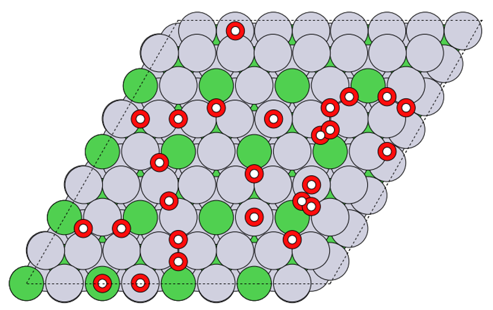

# Nanopads: NANOParticle with ADSorbate
A Python code for generating and encoding adsorbate coverage patterns on nanoparticles.

# Developers: 
Shuang Han (shuha@dtu.dk) - current maintainer

# Dependencies
* Python3
* Numpy
* ASE
* Pymatgen
* Asap3

# Installation
Clone this repository:

```git clone https://gitlab.com/shuanghan/nanopads.git```

# Usage
**Add adsorbates**\
The code can automatically identify the shape and surfaces of nanoparticles, or the type of surface slabs.

To add adsorbate to monometallic system (or if you want to ignore the elemental composition), see example:
```from nanopads.adsorption_sites import monometallic_add_adsorbate
from ase.io import read, write
from ase.visualize import view

atoms = read('random_NiPt_111_surface.traj')
system = monometallic_add_adsorbate(atoms, adsorbate='OH', site='ontop', nsite=5)
system = monometallic_add_adsorbate(system, adsorbate='OH', site='bridge', nsite=6)
system = monometallic_add_adsorbate(system, adsorbate='OH', site='fcc', nsite=7)
system = monometallic_add_adsorbate(system, adsorbate='OH', site='hcp', nsite=8)
view(system)```

To add adsorbate to bimetallic system, see example:
```from nanopads.adsorption_sites import bimetallic_add_adsorbate
from ase.io import read, write
from ase.visualize import view

atoms = read('random_icosahedron_NiPt_309.traj')
system = bimetallic_add_adsorbate(atoms, adsorbate='OH', site='bridge', surface='fcc111', composition='NiPt', second_shell=False, nsite='all')
view(system)```


