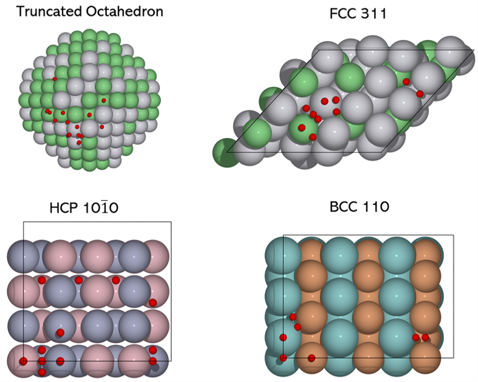

.. ACAT documentation master file, created by
   sphinx-quickstart on Fri Feb 19 01:27:02 2021.
   You can adapt this file completely to your liking, but it should at least
   contain the root `toctree` directive.

ACAT: Alloy Catalysis Automated Toolkit
=======================================
Welcome to ACAT documentation! ACAT is a Python package for atomistic modelling of metal and alloy catalysts used in heterogeneous calaysis. The package is based on the automatic identification of adsorption sites and adsorbate coverages on surface slabs and nanoparticles. Synergized with ASE, ACAT provides useful tools for building atomistic models of alloy catalysts as well as adsorbate coverage patterns. The goal is to automate the workflows so that the structure generations can be readily adapted in a global optimization. 

   All unique adsorptions sites (in red) identified by the code on truncated octahedron (top left), fcc(311) surface (top right), hcp(10-10) surface (bottom left) and bcc(110) surface (bottom right).

.. toctree::
   :maxdepth: 2
   :caption: Contents:

   Installation <installation.rst>
   modules
   Building things <build.rst>
   Genetic algorithm <ga.rst>
   Other utilities <utilities.rst>

Indices and tables
==================

* :ref:`genindex`
* :ref:`modindex`
* :ref:`search`
